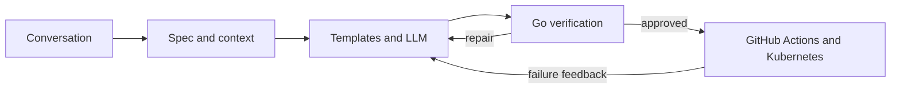

# NL2Service

NL2Service is a conversational agent that turns a natural-language backend request into a
build-verified Go service and can deliver it through GitHub Actions to Kubernetes.

It combines LLM-driven requirement understanding and code refinement with deterministic
templates, validation, local Go verification, persistent LangGraph checkpoints, and CI/CD
feedback. Generated services use open-source components from the public
[tRPC-Go](https://github.com/trpc-group/trpc-go) ecosystem.

## What it automates

From one interactive conversation, NL2Service can:

1. Understand the requested API and integrations.
2. Ask about material missing details and accept corrections at any point.
3. Build a typed service specification while retaining open-ended requirements as conversation
   context.
4. Select relevant verified examples as generation references.
5. Render and refine a complete Go project.
6. Run `go mod tidy`, `go vet`, and a local build.
7. Repair generated code using build feedback.
8. Commit the verified project directly to GitHub after confirmation.
9. Monitor GitHub Actions as it builds and publishes the container image.
10. Feed CI/CD failures back into the repair loop or return a deployment report on success.

The generated project can include HTTP and tRPC handlers, MySQL or PostgreSQL access, Kafka
producers and consumers, Docker packaging, Kubernetes manifests, and a GitHub Actions workflow.

## Proven end-to-end

[simpleService](https://github.com/qw33ha/simpleService) was automatically implemented and
delivered by NL2Service from a natural-language request. The generated service:

- accepts JSON over HTTP;
- publishes events to Kafka;
- conditionally writes data to MySQL;
- builds and packages successfully in GitHub Actions; and
- deploys to Google Kubernetes Engine.

This demonstrates the complete path from conversation to a running cloud service—not only code
generation.

## Core architecture

NL2Service has four main parts:

1. **Conversation and orchestration** — A LangGraph workflow keeps the conversation, asks for
   missing information, accepts corrections, requests approval, and resumes long-running work
   from SQLite checkpoints.
2. **Requirements** — Pydantic stores the stable generation and deployment settings. Business
   rules and unexpected answers remain in conversation history, so the agent is not limited to a
   fixed form.
3. **Generation and verification** — Jinja templates create the predictable tRPC-Go structure;
   the LLM adapts the business logic. The Go toolchain then verifies the result and returns build
   failures to the agent for repair.
4. **Delivery** — After approval, NL2Service commits the verified project to GitHub. GitHub
   Actions builds the container and optionally deploys it to Kubernetes. Remote failures return
   to the same repair workflow.

This creates a clear boundary: the LLM handles meaning and implementation choices, while normal
code controls validation, state transitions, file generation, builds, and external operations.



## Installation

Requirements:

- Python 3.11 or newer
- Go toolchain for local verification
- An OpenAI API key
- Git and a GitHub token when repository delivery is requested

```bash
git clone https://github.com/qw33ha/NL2TRPCService.git
cd NL2TRPCService
python -m venv .venv
source .venv/bin/activate
pip install -e .
```

Configure the agent:

```bash
export OPENAI_API_KEY="..."
export GITHUB_TOKEN="..."                # required only for GitHub delivery
export NL2SERVICE_OPENAI_MODEL="gpt-4.1-mini"  # optional
```

`OPENAI_BASE_URL`, `OPENAI_ORG_ID`, and `OPENAI_PROJECT_ID` are also supported when needed.

## Usage

Start with a natural-language request:

```bash
nl2service "Build an HTTP service that accepts JSON, publishes it to Kafka, and stores selected fields in MySQL when env is prod"
```

The agent continues in the same terminal, asking only for information needed to generate or
deploy the service. A conversation is durably checkpointed in `~/.nl2service/agent.db`.

If the session is interrupted, resume it using the printed thread ID:

```bash
nl2service --thread <thread-id>
```

You can ask questions, correct a previous value, reject a proposal and revise it, or explicitly
stop the conversation. Approval is required before code delivery.

## One-time deployment preparation

NL2Service generates and operates the application delivery workflow, but it does not silently
create or take ownership of cloud infrastructure. For Kubernetes deployment, prepare:

- a reachable Kubernetes cluster and namespace;
- a cloud service account with appropriately scoped cluster permissions;
- GitHub-to-cloud authentication, preferably workload identity federation;
- repository secrets or variables identifying the cloud project, cluster, and region;
- permission for GitHub Actions to publish container images;
- Kubernetes Secrets for runtime database or Kafka credentials;
- network access from the workload to external dependencies; and
- required database tables and Kafka topics.

The agent asks for the relevant non-secret identifiers and generates matching workflow and
Kubernetes files. Passwords, tokens, private keys, and kubeconfig content belong in GitHub or
Kubernetes secret storage, never in prompts or generated source code.

Deployment is optional. If no Kubernetes environment is available, NL2Service can stop after the
verified build and GitHub delivery stages.

## Included reference services

The `examples/` directory provides verified patterns used as a generation knowledge base:

- `minimal-trpc-http-echo` — tRPC and HTTP service structure
- `minimal-trpc-mysql-user` — MySQL CRUD integration
- `minimal-trpc-kafka-event` — authenticated Kafka publishing and consumption

The examples and generated templates rely on public GitHub dependencies. Provider credentials
and private infrastructure details are intentionally excluded.

## Project structure

```text
nl2service/agent/       conversation routing, ambiguity analysis, and code refinement
nl2service/spec/        typed specification, normalization, and validation
nl2service/render/      Jinja templates and artifact rendering
nl2service/build/       local Go verification
nl2service/tools/       GitHub, Actions, and Kubernetes operations
nl2service/workflow/    LangGraph workflow, repair loop, and delivery state
nl2service/runtime/     durable checkpoints and CI monitoring
examples/               verified tRPC-Go integration references
```

## Next version

The current milestone proves the complete path from conversation to a deployed service. A
practical next version would focus on:

- an evaluation suite built from real service requests and known failure cases;
- stronger generation for services with multiple endpoints, models, and interacting handlers;
- generated unit and integration tests alongside the service code;
- additional reusable integrations such as object storage, external REST APIs, and
  observability;
- better diagnosis and repair of build, CI, deployment, and configuration failures; and
- clearer deployment reports with service status, logs, and dependency health.

NL2Service remains an end-to-end prototype rather than a production control plane. Generated code
and infrastructure permissions should be reviewed before production use.

## License

NL2Service is available under the [MIT License](LICENSE).
